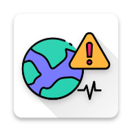

# 🌍 Deprem Bilgisi
### Real-Time Earthquake Tracker for Turkey & the World

[-blue)](https://developer.android.com)

*Stay informed. Stay safe.*

---

## 📖 About

**Deprem Bilgisi** (Earthquake Information) is a free, independent Android app that brings real-time earthquake data from three official sources directly to your pocket. Whether you're in Turkey or anywhere in the world, Deprem Bilgisi keeps you informed — and when disaster strikes, it gives you the tools to survive.

Built with care by an independent developer, this app is designed to be fast, reliable, and genuinely useful in emergencies.

---

## ✨ Features

### 🗺️ Real-Time Earthquake List
Get the latest earthquakes sorted by time, color-coded by magnitude:

| Color | Magnitude | Meaning |
|:---:|:---:|:---|
| 🟢 Green | ≤ 2.9 ML | Minor |
| 🟠 Orange | 3.0 – 4.0 ML | Moderate |
| 🔴 Red | 4.1+ ML | Strong |

### 🌐 Three Data Sources
Switch between official earthquake data providers with a single tap:

- 🏛️ **Kandilli Observatory (KOERI)** — Boğaziçi University, Turkey
- 🇹🇷 **AFAD** — Official Turkish Disaster Authority
- 🌍 **EMSC** — European Mediterranean Seismological Centre (worldwide)

### 🗺️ Interactive Earthquake Map
- All earthquakes plotted on a live map
- Color-coded markers scaled by magnitude
- Tap any marker for full details
- **Fault line overlay** — visualize Turkey's major fault lines
- **Nearby filter** — show only earthquakes within your chosen radius

### 🔔 Smart Notifications
- Get notified when an earthquake exceeds your magnitude threshold
- Each earthquake notifies only once — no repeated alerts
- Fully customizable threshold (1.0 – 7.0 ML)

### 📍 Location-Based Filtering
- Filter the list and map to show only earthquakes near you
- Adjustable radius from 100 km to 2,000 km
- Works with both the list view and the map

### 🆘 Emergency Survival Tools
When every second counts:

| Tool | Description |
|:---|:---|
| 📞 **112 Emergency Call** | One tap to call emergency services |
| 🔊 **Whistle** | Loud alarm tone to signal rescuers |
| 🆘 **S.O.S Whistle** | Morse code (· · · — — — · · ·) alarm |
| 🔦 **Flashlight** | Instantly activate your phone's torch |
| 🆘 **S.O.S Flashlight** | Morse code S.O.S flash pattern |

### 🎨 Personalization
- Light / Dark / System theme
- Magnitude filter for the list view
- Persistent settings across sessions

---

## 📸 Screenshots

> *Coming soon*

---

## 🔒 Privacy

Deprem Bilgisi is built with privacy as a core principle:

- ✅ **No user accounts** — no sign-up, no login
- ✅ **No data collection** — your data never leaves your device
- ✅ **No ads** — completely ad-free
- ✅ **No tracking** — zero analytics or telemetry
- ✅ **Open data sources** — all earthquake data comes from official public APIs

📄 [Read the full Privacy Policy](privacy_policy.md)

---

## 📡 Data Sources

| Source | Coverage | URL |
|:---|:---|:---|
| Kandilli Observatory | Turkey & region | koeri.boun.edu.tr |
| AFAD | Turkey (official) | deprem.afad.gov.tr |
| EMSC | Worldwide | seismicportal.eu |

---

## 📋 Permissions Explained

| Permission | Why It's Needed |
|:---|:---|
| `INTERNET` | Fetch earthquake data from official sources |
| `ACCESS_FINE_LOCATION` | Show earthquakes near your location |
| `ACCESS_COARSE_LOCATION` | Fallback location for nearby filter |
| `POST_NOTIFICATIONS` | Send earthquake alerts |
| `CALL_PHONE` | Enable one-tap 112 emergency call |
| `RECEIVE_BOOT_COMPLETED` | Resume monitoring after device restart |
| `FOREGROUND_SERVICE` | Run background earthquake monitoring |

---

## 🛠️ Built With

- **Kotlin** — Modern Android development
- **Material Design 3** — Clean, accessible UI
- **Leaflet.js** — Interactive earthquake maps
- **WorkManager** — Reliable background monitoring
- **OkHttp** — Efficient network requests
- **OpenStreetMap / CARTO** — Map tiles

---

## 👨‍💻 Developer

**Arif Onur Bütün**  
Independent Android Developer  
AR-SE Technology

*Built with ❤️ for the people of Turkey and beyond.*

---

## ⚠️ Disclaimer

This app is for **informational purposes only**. For official earthquake warnings and evacuation orders, always follow guidance from **T.C. AFAD** and authorized government agencies.

---

© 2026 Arif Onur Bütün · AR-SE Technology

